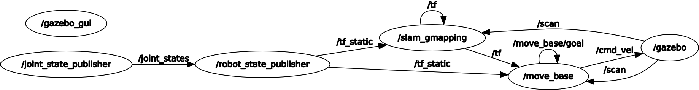
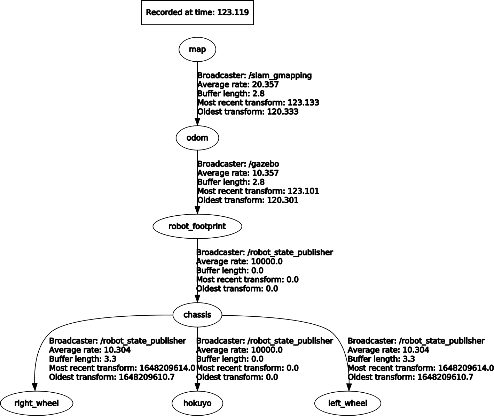
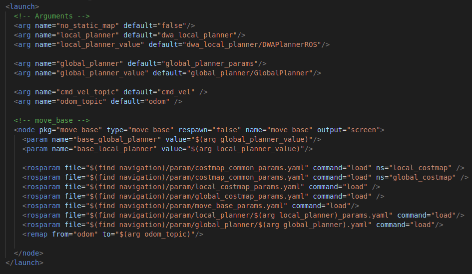
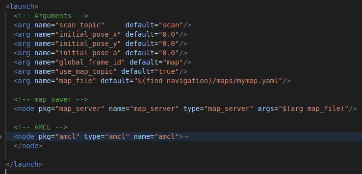

# Alpha
## FOLDER ARCHITECTURE

The workspace is constructed in the below mentioned way. 

```sh
workspace
    src
        alpha----------------------package
            launch 
            meshes
            rviz
            urdf
            worlds
            package.xml
            CMakeLists.txt
        navigation-----------------package
            launch
            maps
            param
            package.xml
            CMakeLists.txt
        teleop---------------------package
            launch
            package.xml
            CMakeLists.txt
        CMakeLists.txt
    shell files
```


## ROS PACKAGES

Some of the default ROS packages and some custom ROS packages are used here.

```
Default packages: 
    gazebo_ros
    joint_state_publisher
    robot_state_publisher
    rviz
    gmapping
    move_base
    turtlebot_teleop
    map_server
    amcl

Custom packages:
    alpha
    navigation
    teleop
```

## INTERCONNECTION OF THE PACKAGES

The custom packages are built in a way they call the default packages and necessory nodes in an orderly manner.

```
alpha 
    gazebo_ros
    joint_state_publisher
    robot_state_publisher
    rviz
navigation
    gmapping
    move_base
    amcl
    map_server
teleop
    turtlebot_teleop
```

The nodes are connected to each other in the below mentioned way.



The transforms are built in the following manner.



## WORK-FLOW

The robots which are able of interacting with their environments, moving, and even other objects can be simulated in ROS and Gazebo. The interfaces range from graphical tools to C++ APIs, allowing users and developers to debug robot behavior. RViz is a visualizer for ROS topics which is invaluable during application development and debugging. The purpose of Gazebo is to be the best possible software-only substitute for physical robots. The whole thing can summarize into a sense-think-act cycle.

Alpha_navigation is capable of mapping an unknown environment, localizing a robot in a map, and reaching a goal in a known environment. These three capabilities come with the workflow of the robot. Slam-Gmapping package embeds the ability to build a map. The Amcl is the package that localizes the robot on a map. Move base publishes velocity commands to the differential drive plugin. The previously mentioned capabilities are different use cases of these three packages.

### Design a robot model.

Choosing an appropriate robot chassis for the design is the first step of the process. The move base package is only designed for use with the square shape chassis. Also, it will work with cylindrical chassis as well. If we choose a rectangular or triangle shape chassis, its performance will drastically reduce. Therefore, the cylindrical shape will be using here.

A sensor is essential for retrieving data of the environment. When you select a sensor, there is a bunch of alternatives in the market these days. Also, there are lots of facts to consider. The indoor navigation of the mobile robot can do using a light detection and ranging sensor (LiDAR) because of the fewer interruptions in an indoor navigation than in an outdoor navigation. 
LiDAR emits light particles (photons). The photons then bounce back to the sensor. By measuring distance and time to every object, it publishes that data. Here we are going to use Hokuyo LiDAR hence, its gazebo plugin is available.

In ROS, we can use URDF for defining the robot model. The xacro can also be used in both rviz visualization and Gazebo. So, we define the robot in xacro. We maintain two xacros, one for defining the links and joints and the other for the plugins. Plugins are used for defining the sensor behavior. The sensor and the differential drive are subscribed and published to relevant topics to behave as expected. 


### Spawn in Rviz and Gazebo 

In this step, we create a launch file to spawn the robot model into our development environment. The inorder spawning is used to do that. When launching this file, all the topics, links, and joints will be configured. You can create a building model using gazebo building editor tool. It can be easily added to a world at the same time.

To visualize the robot model in Rviz, we need to create a launch file. By doing this we can visualize links and joints in a graphical interface. Still, we don't have any sensor readings hence the virtual environment is not launched yet. At this point, we create another launch file for spawn model in both rviz and gazebo. Now we can see that our sensor topics publishing sensor readings.

No we are in a better position to create our own world. To create a world we should first build our building model and save it using gazebo building editor. The add the model to the empty world witout adding robot model to it. Then add it to the previously created launch file as an argument. 

Now we can double check everything. As the next step we can do teleoperation of the robot inside the gazebo environmrnt.

### Teleoperation

Teleoperation is used for navigate robot around the world. We have to initialize a node using the teleop-twist-keyboard package. We have to make sure that topics are correctly remapped. The commadTopic of the differential drive plugin needs to matched with the teleop cmd_vel topic. After succesfully launching this package, you will be able to control the robot using keyboard inputs.


### Slam-Gmapping 

The gmapping package provides laser-based Simultaneous Localization and Mapping, as a ROS node called slam_gmapping. Using slam_gmapping, you can create a 2-D occupancy grid map from laser and pose data collected by a mobile robot. We will be using teleop-twist-keyboard package for teleoperation of the robot.
When initiating the slam-gmapping package we have to make sure that its properly subscribed to the scan topic. The LiDAR will publish its data to scan topic. 

To build a map of the environment as same as in the gazebo, we drive robot untill it retrieves all the information of the environment. The generated map can be saved using the map-server package. The saved map will be used in the localization process. 

### Navigation Stack

The Navigation Stack is fairly simple on a conceptual level. It takes in information from odometry and sensor streams and outputs velocity commands to send to a mobile base. 


 
The navigation stack assumes that the robot is configured in a particular manner in order to run. The diagram above shows an overview of this configuration. The white components are required components that are already implemented, the gray components are optional components that are already implemented, and the blue components must be created for each robot platform.

Created a node for move base specifying required arguments in a file called move_base.launch


 
**Global planners and Local planners**

It is vital to use suitable combination of global and local planners in the navigation stack we implement. Some of the planners are merely just outdated and some of them are application specific. 

GlobalPlanner is an improved version of NavFn in some aspects. While the local planners are still used in various applications. 

|       | dwa | teb      | eband | base_local_planner (trajectory) |
| ----------- | ----------- | ----------- | ----------- |----------- |
| NavFn     | used in static environment|  used in dynamic environment | good in planing shorter paths     | Outdated       |
| GlobalPlanner   | Best for static environment | good in dynamic environment | good in planing shorter paths    | Outdated       |


### AMCL localisation

amcl is a probabilistic localization system for a robot moving in 2D. It implements the adaptive (or KLD-sampling) Monte Carlo localization approach (as described by Dieter Fox), which uses a particle filter to track the pose of a robot against a known map.

amcl takes in a laser-based map, laser scans, and transform messages, and outputs pose estimates. On startup, amcl initializes its particle filter according to the parameters provided.

A separate launch file is created (amcl.launch) to specify required arguments and launch map_server and amcl nodes. The relevant path for the map file is also specified.



## HOW TO EXECUTE

### Getting started
1. First of all clone this repository to your local workspace package level. 

    ```sh
    git clone https://github.com/MayooranT/Alpha-robot.git
    ```

    _You should see some .sh files alongside with src_ 

2. Install all the system dependencies required to run the simulation.

3. Build the workspace
    
    ```sh
    catkin_make
    ```

    _You should see the directories build, devel, logs alongside with src_ 


### Spawn the robot

1. Run the followings to make the .sh files executable.

    ```sh
    chmod +x spawn.sh
    chmod +x gazebo.sh
    chmod +x gmapping.sh
    chmod +x amcl.sh
    chmod +x all.sh
    ```

2. Run the following command to run the required ROS components and Rviz along with necessory ROS dependencies. 
    ```sh
    ./spawn.sh
    ```
3. If you need a visualizer, run the following to launch Gazebo.

    ```sh
    ./gazebo.sh
    ```

### Playing around with Gmapping

1. Gmapping can be run by the following command.
    ```sh
    ./gmapping.sh
    ```

2. Select 2D nav goal in the top panel in the top panel. Select the point you want your robot to move and the orientation it should face. You should see your robot planning the path and achieving the goal while exploring the map!!!

### Keyboard Control

1. Run the following to control your robot using the keyboard. 

    ```sh
    roslaunch teleop teleop.launch
    ```

2. Use the mentioned keys in the terminal to run your robot around.

### Explore the environment.

1. You can use either the 2D nav goal or teleop to explore the whole environment. 
2. When you get the whole environment, use the follwing command to save the map locally. 

    ```sh
    rosrun map_server map_saver -f mymap
    ```
    _You can give a name for your map instead of "mymap"_ 
    _This command will save the map you've explored as two files ( .yaml and .pgm ) inside the workspace you are using_ 
3. Using the map we have just saved to localise the robot on it is discussed in the next repo.

## Playing around with AMCL Localisation

1. The map and the AMCL node can be launched by the following.
    ```sh
    ./amcl.sh
    ```

Sometimes you will see the robot is localised in a wrong position and orientation. To localise it in the correct postion, follow the steps.

1. Select the 2D pose estimate from the top panel in Rviz.
2. Click on the point where the robot should be localised and drag the pointer to the direction which the robot should orientated. 
3. Now you will see the Costmap and the Map will roughly fix on the other.
4. You can see the the AMCL pose estimates are scattered all around the robot. (the probability of the position and orientation the robot can be)
5. Use the 2D nav goal or teleop to move the robot around.
6. Suprisingly, you should see the AMCL pose estimates shrinks, and the costmap fixes perfectly with the map. 

## Launching everything with AMCL 

This command will spawn the robot, start Gazebo and finally launch AMCL.

    ./all.sh
    
## Battery State Publisher

The battery status of the robot can be simulated artificially by decrementing the initial value with time. Even though, this is not the real battery value, this can be used to simulate and test in a virtual environment. This battery state will publish a ROS defined msg type sensor_msgs/Battery_state to a custom defined topic /battery_status

    rosrun alpha battery_state_pub2.py
    
